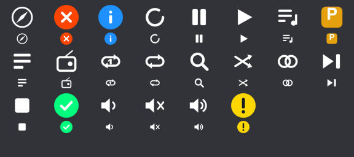
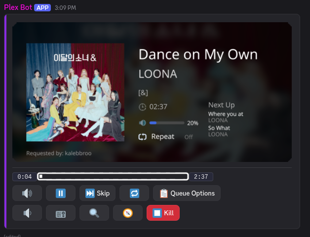

# Custom emoji

PlexBot ships with 22 emoji drawn for the player and its panels. They are uploaded to your bot's application
automatically the first time it starts. You don't upload anything by hand.

The player buttons use these emoji, with a text label beside each one. If an emoji is missing, the button shows its
plain unicode symbol instead.

## What you get



| Group | Names |
|---|---|
| Player controls | `pb_play`, `pb_pause`, `pb_skip`, `pb_stop`, `pb_repeat`, `pb_repeat_track`, `pb_shuffle`, `pb_volume_up`, `pb_volume_down`, `pb_volume_mute` |
| Features | `pb_radio`, `pb_similar`, `pb_adventure`, `pb_search`, `pb_queue`, `pb_playlist`, `pb_plex` |
| Status | `pb_success`, `pb_error`, `pb_info`, `pb_warning`, `pb_loading` |

They are **application emoji**. Discord stores them against the bot's application, not against a server. That
means:

- they work in every server the bot is in, with no emoji slots used up,
- you don't need the Manage Expressions permission on any server.

## Setting up a new bot

1. Start the bot as normal (`Install/start.sh --build`, or `dotnet run`).
2. Watch the log for the sync. The first start creates every emoji:

   ```
   Created application emoji :pb_adventure:
   ...
   Application emoji ready: 52 available (22 uploaded, 0 replaced)
   ```

3. Check them in the Discord Developer Portal. Open your application, click **Emojis** in the left sidebar, and
   you should see every `pb_*` name:

   

Restarts after that create nothing. The bot remembers each image's hash in `data/emoji-hashes.json`, so it only
uploads again when an image changes.

## Changing an emoji's art

Edit the PNG in `Images/Emoji` and restart the bot. The sync compares each file's hash with the saved one. If it
changed, the bot deletes the old emoji and uploads the new one. The log says so:

```
Application emoji ready: 52 available (0 uploaded, 1 replaced)
```

Rules for the images:

- PNG, under 256 KB. The art is 128×128 with a transparent background.
- The file name, without `.png`, is the emoji name. It must be at least 2 characters and use only letters, numbers
  and underscores.
- Keep the `pb_` prefix. The bot only syncs files that start with it.

## Making your own set

The generator in `Tools/EmojiGenerator` draws the set with SkiaSharp. It also writes a contact sheet so you can
check the art at Discord's real sizes (44px and 22px) on a dark background before the bot uploads anything:

```bash
dotnet run --project Tools/EmojiGenerator -- Images/Emoji Images/PlexBotBanner.png emoji-contact-sheet.png
```

Edit the glyph definitions in `Tools/EmojiGenerator/Program.cs`, re-run, read the contact sheet, then restart the
bot. Anything that looks muddy at 22px needs thicker strokes.

## When the emoji are missing: the fallback

The bot never shows a broken emoji. Anywhere it needs a `pb_*` emoji that isn't available, it uses a plain unicode
symbol instead, such as ▶️ ⏸️ ⏭️ 🔊. The player still works, and it looks plainer:



Fallbacks happen in three cases:

- **The sync couldn't run.** The log shows `Could not sync application emoji, using unicode fallbacks: ...`. The error message
  names the cause, usually a Discord or network error.
- **The Images/Emoji folder isn't where the bot expects.** The log shows `Emoji folder not found`. Check that the
  folder was copied into the Docker image, or that you're running from the project root.
- **One emoji failed to upload.** The sync logs the error and keeps going, so every other emoji still works.

The fallback is only cosmetic. Nothing else depends on the emoji.

## Troubleshooting

| You see | Cause | Fix |
|---|---|---|
| `Emoji folder not found` | `Images/Emoji` isn't in the build output | Rebuild with `Install/start.sh --build`; check that `Images/` is copied |
| `Could not sync application emoji` | Token, network or application problem | Fix the error in the message, then restart |
| Emoji show as broken squares | Emoji were deleted in the Developer Portal | Restart the bot; missing emoji are uploaded again |
| Changed a PNG, nothing changed | Restart not done, or the file doesn't start with `pb_` | Restart; check the file name |
| Log says 0 uploaded, 0 replaced every time | Expected once everything is synced | Nothing to do |

## The progress bar is separate

The smooth progress bar uses 30 older emoji (`bar_*`). They are not part of this sync. They are set up by hand and
their IDs go in `config.fds`. See [Configuration](../Setup/Configuration.md#custom-progress-bar-emoji). If they
aren't set up, the bar uses `▓░` characters.
