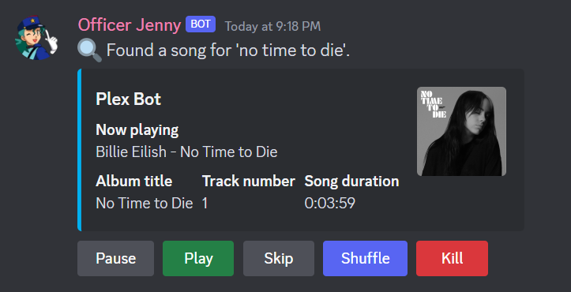

# Plex Music Bot (BETA) v0.7

Download releases for current stable builds. Master will be Dev builds.

This Discord bot allows users to play audio from their Plex library in a voice channel.
New BUTTONS and slash commands! use thses buttons to control the bot!

# Features
- Search for and play songs from a Plex library

- Play audio from another popular website

- Manage a song queue with play, skip, shuffle, and loop functionality

- Automatically disconnect after 2 minutes of inactivity when the queue is empty

# Commands
- `/play <song title> <artist>`: Search for a song by title or artist in your Plex library and play it. If a song is already playing, the new song will be added to the queue.
(This is the main command you will use but it only plays/adds 1 song)

- `kill`: Stop playing music and disconnect the bot from the voice channel. (button)

- `/remove_song <song index>`: Remove a specific song from the queue by its position in the queue.

- `/album <album title> <artist>`: Queue all songs from the specified album or list albums by an artist if only the artist name is provided.

- `/playlist`: List all available playlists and play songs from the chosen playlist by selecting its number.
(This is one of the most powerful commands because you can setup playlists in Plex then quickly start playing them.)

- `/queue`: Display the current song queue with song titles and artists.

- `shuffle`: Randomly shuffle the current song queue. (button)

- `/artist <artist name>`: Queue all songs by the specified artist from your Plex library.

- `skip`: Skip the current song and play the next song in the queue. (button)

- `/youtube <YouTube URL, Playlist URL, or search query>`: Play audio from a YouTube video using its URL, or search for a video or playlist and play the first result. 
(Added a new library to search for videos. It is now much faster! Playlists are still slow so i dont really recommend them)

- `/clear_queue`: Remove all songs from the current queue.

- `/help`: Show a summary of available commands.

- `/help <command>`: Show more detailed information on a specific command.

# Prerequisites
Python 3.11.2 or higher
A Discord bot token
A Plex server with valid credentials
(I have moved to using a plex token and base-url for cridentials.)

# Installation
Clone this repository or download it as a ZIP file and extract it.

git clone https://github.com/kalebbroo/plex_music_bot.git

Change the working directory to the project folder.

Add your cridentials to the config.py or set them up how you like. 

cd your-repo

(only do the below steps if you are using a virtual environment)
Create a virtual environment and activate it.
python -m venv venv
source venv/bin/activate  # For Windows: venv\Scripts\activate

# Docker Installation (recommended)
- Install Docker on your system by following the instructions from the official Docker documentation.

- Clone this repository or download it as a ZIP file and extract it:

git clone https://github.com/kalebbroo/plex_music_bot.git
Change the working directory to the project folder:

- cd plex_music_bot

- Build the Docker image:
Copy code
docker build -t plex_music_bot .

- Run the Docker container

docker run -d --name plex_music_bot

# Install the required dependencies.

pip install -r requirements.txt

Install ffmpeg. Depending on your operating system, you may be able to install ffmpeg using your package manager. For example, on Ubuntu or Debian, you can run 'sudo apt-get install ffmpeg' to install ffmpeg. On macOS, you can use Homebrew by running 'brew install ffmpeg'.

Enter your cridentials into config.py or use environment variables.

# Environment Variables
(This is optional if you use the config.py you dont need to do this)
Set up environment variables for your Discord bot token, Plex username, and Plex password. You can either use an .env file or set the environment variables in your shell.
Using an .env file

echo "DISCORD_TOKEN=your-discord-bot-token" > .env
echo "PLEX_USERNAME=your-plex-username" >> .env
echo "PLEX_PASSWORD=your-plex-password" >> .env

Or setting environment variables in your shell (Linux and macOS)
arduino

export DISCORD_TOKEN=your-discord-bot-token
export PLEX_USERNAME=your-plex-username
export PLEX_PASSWORD=your-plex-password

Or setting environment variables in your shell (Windows)
arduino

set DISCORD_TOKEN=your-discord-bot-token
set PLEX_USERNAME=your-plex-username
set PLEX_PASSWORD=your-plex-password

Modify the bot script to use the environment variables instead of hardcoded values:

# Running the bot
Ensure that the virtual environment is activated or have config.py filled in.

source venv/bin/activate  # For Windows: venv\Scripts\activate
Run the bot script.

python plex_music_bot.py
Invite the bot to your Discord server using the following link, replacing YOUR_CLIENT_ID with your bot's client ID:

https://discord.com/oauth2/authorize?client_id=YOUR_CLIENT_ID&permissions=8&scope=bot

Once the bot is running and invited to your server, you can start using the commands in a text channel. Use !help to see the available commands and their usage.

# Updating the bot
To update the bot with new features or bug fixes, you can pull the latest changes from the repository (if you cloned it) or download and extract the new version as a ZIP file.

Pull the latest changes (if you cloned the repository).

git pull
Or download the new version as a ZIP file and extract it.

Update the dependencies in the virtual environment.

pip install -r requirements.txt

Restart the bot by stopping the current instance and running it again.

python plex_music_bot.py

Using Docker:
Rebuild the Docker image:

docker build -t plex_music_bot .
Stop the running container:

docker stop plex_music_bot
Remove the stopped container:

docker rm plex_music_bot
Run the updated Docker container:

docker run -d --name plex_music_bot

# Contributing
Feel free to submit issues, feature requests, or pull requests to contribute to this project.

# Join the Discord for Support
https://discord.gg/CmrFZgZVEE