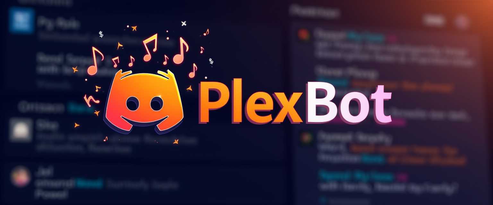
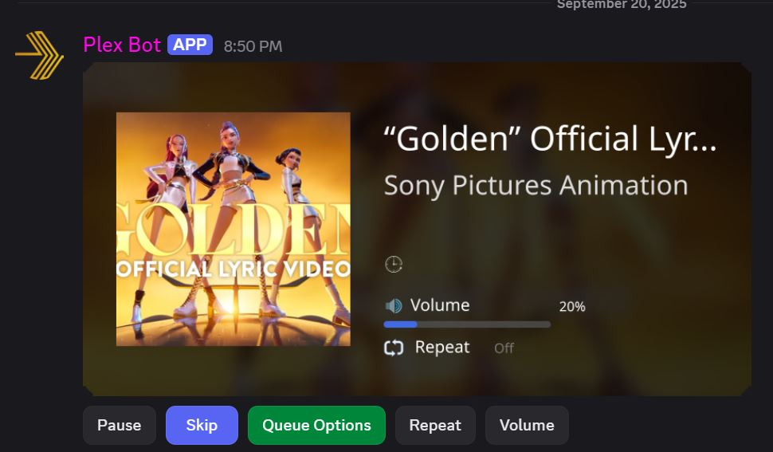
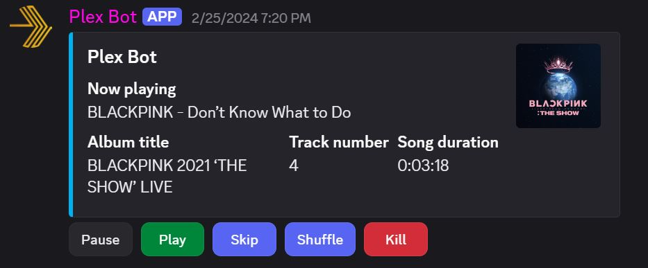

# 
> **Play your Plex music in Discord with style.** <sup><kbd>Alpha 0.5</kbd></sup>
---

<!-- PLACEHOLDER: Add screenshots of the Modern Visual Player and Classic Player Embed below -->

| Modern Visual Player | Classic Player Embed |
|:-------------------:|:-------------------:|
|  |  |

---

## What Does this bot do and why did I make it?

**PlexBot** is a next-generation Discord music bot designed for Plex users. Seamlessly stream your personal music library (and more!) into your server’s voice channels, enjoy a beautiful visual player, and take advantage of a robust extension system for ultimate flexibility.

---

## ⭐ Features

- **Stream from Plex**: Play tracks, albums, artists, and playlists directly from your Plex server.
- **YouTube Support**: Search and play music from YouTube.
- **Interactive Player UI**: Choose between a modern image-based player or a classic Discord embed.
- **Static Player Channel**: Optionally dedicate a channel for the persistent player UI.
- **Rich Queue Management**: Add, remove, shuffle, and loop tracks with intuitive controls.
- **Slash Commands**: Clean, discoverable, and autocomplete-enabled.
- **Extensible**: Powerful [Extensions system](./Docs/Extensions/CreatingExtensions.md) for custom features.
- **Easy Setup**: [Guided installation](./Docs/Setup/Installation.md) and [Docker support](./Docs/Setup/Docker-Guide.md).
- **Troubleshooting & Guides**: [Player UI Guide](./Docs/Guides/Player-UI-Guide.md), [Troubleshooting](./Docs/Guides/Troubleshooting.md), and more.

---

## 🚧 Planned & Upcoming Features

- **More Music Sources**: Spotify, SoundCloud, and additional streaming integrations.
- **User Custom Playlists**: Save, manage, and share your own playlists within Discord.
- **Expanded Command Set**: More slash commands for advanced control and new features.
- **Command Panel UI**: In static player channels, use an interactive command panel (embed with buttons) for a seamless experience (no slash commands needed).
- **Additional Visual Player Styles**: Choose from more themes and layouts for the player UI.
- **And much more...**

---

## 🎨 Visual Player Styles

PlexBot offers two distinct player UIs:

### 1. Modern Visual Player
- **Sleek, image-based**: Uses album art as a background, overlaying track info and controls for a rich, modern look.
- **Best for dedicated channels**: Looks stunning as a persistent player in a static channel.

### 2. Classic Player Embed
- **Traditional Discord embed**: Familiar, compact, and works anywhere.
- **Great for multi-purpose channels**: Shows album art as a thumbnail.

All player settings are in `config.fds` (see [Configuration](#-configuration) below).

For more, see the [Player UI Guide](./Docs/Guides/Player-UI-Guide.md).

---

## ⚡ Slash Commands

<details>
<summary><b>/search [query] [source]</b></summary>
Search your Plex library or YouTube. Interactive menus for artists, albums, and tracks.
<br>Example: <code>/search query:"The Beatles" source:"plex"</code>
</details>

<details>
<summary><b>/playlist [playlist] [shuffle]</b></summary>
Play a full Plex playlist, optionally shuffled.
<br>Example: <code>/playlist playlist:"Summer Hits" shuffle:true</code>
</details>

<details>
<summary><b>/play [query]</b></summary>
Quickly play a track, album, or artist by search term.
<br>Example: <code>/play query:"Bohemian Rhapsody"</code>
</details>

<details>
<summary><b>/help</b></summary>
Show an interactive help menu with all commands and usage tips.
</details>

---

## 🚀 Getting Started

See the [Installation Guide](./Docs/Setup/Installation.md) and [Configuration Guide](./Docs/Setup/Configuration.md) for full details.

### Prerequisites
- Docker & Docker Compose (Docker Desktop recommended)
- Discord bot token ([Developer Portal](https://discord.com/developers/applications))
- Plex server URL and token ([How to get a Plex token](https://support.plex.tv/articles/204059436-finding-an-authentication-token-x-plex-token/))

### Quick Install
```bash
git clone https://github.com/kalebbroo/PlexBot.git
cd PlexBot
```

1. **Secrets** — Copy `RenameMe.env.txt` to `.env` and fill in your credentials:
   ```env
   DISCORD_TOKEN=your-discord-bot-token
   PLEX_URL=http://your-plex-ip:32400
   PLEX_TOKEN=your-plex-token
   ```

2. **App settings** — Copy `RenameMe.config.fds` to `config.fds`. All player, logging, and behavior settings live here (see [Configuration](#-configuration) below).

3. **Run the install script** — `Install/win-install.bat` (Windows) or `Install/linux-install.sh` (Linux). This builds the Docker images, installs dependencies, and starts the bot.

---

## 🔧 Configuration

PlexBot uses **two config files**:

| File | Purpose | Template |
|------|---------|----------|
| `.env` | Secrets & infrastructure (tokens, URLs, passwords) | `RenameMe.env.txt` |
| `config.fds` | Application settings (player UI, logging, behavior) | `RenameMe.config.fds` |

### `.env` — Secrets & Infrastructure

| Variable | Description | Required |
|----------|-------------|----------|
| `DISCORD_TOKEN` | Discord bot token | Yes |
| `PLEX_URL` | Plex server URL with port (e.g. `http://192.168.1.50:32400`) | Yes |
| `PLEX_TOKEN` | Plex authentication token | Yes |
| `LAVALINK_HOST` | Lavalink hostname — `Lavalink` for Docker, or IP/hostname for remote (default: `Lavalink`) | No |
| `LAVALINK_SERVER_PORT` | Lavalink port (default: `2333`) | No |
| `LAVALINK_SERVER_PASSWORD` | Lavalink password (default: `youshallnotpass`) | No |
| `LAVALINK_SECURE` | Use HTTPS/WSS for Lavalink connection — set `true` for remote servers behind SSL (default: `false`) | No |

### `config.fds` — Application Settings

Uses [Frenetic Data Syntax](https://github.com/FreneticLLC/FreneticUtilities) (YAML-like format). All settings have sensible defaults — you only need to change what you want to customize.

#### Visual Player

| Key | Type | Default | Description |
|-----|------|---------|-------------|
| `visualPlayer.useModernPlayer` | bool | `true` | `true` = album art image player, `false` = classic Discord embed |
| `visualPlayer.inactivityTimeout` | float | `2.0` | Minutes of silence before the bot auto-disconnects from voice |
| `visualPlayer.staticChannel.enabled` | bool | `false` | Lock the player to one specific channel |
| `visualPlayer.staticChannel.channelId` | int | `0` | Discord channel ID (right-click channel > Copy Channel ID) |
| `visualPlayer.progressBar.enabled` | bool | `true` | Show a live-updating progress bar (updates every second). Disable to reduce Discord API calls |
| `visualPlayer.progressBar.emoji.*` | int | _(empty)_ | Custom Discord emoji IDs for smooth-fill progress bar. Leave empty for unicode fallback (`▓░`) |

#### Plex

| Key | Type | Default | Description |
|-----|------|---------|-------------|
| `plex.maxConcurrentResolves` | int | `3` | Max parallel track resolves when loading playlists/albums. Lower if tracks fail to load; higher loads faster but may overwhelm Plex |

#### Logging

| Key | Type | Default | Description |
|-----|------|---------|-------------|
| `logging.level` | string | `INFO` | Console log level: `VERBOSE`, `DEBUG`, `INFO`, `WARN`, `ERROR`. Log files always save all levels |
| `logging.saveToFile` | bool | `true` | Save log files to disk |
| `logging.path` | string | `logs/plex-bot-[year]-[month]-[day].log` | Log file path (supports `[year]`, `[month]`, `[day]`, `[hour]`, `[minute]`, `[second]`, `[pid]`) |

#### Bot

| Key | Type | Default | Description |
|-----|------|---------|-------------|
| `bot.environment` | string | _(empty)_ | Set to `Development` for guild-scoped slash commands (faster updates during dev) |

### Custom Progress Bar Emoji

PlexBot includes 30 custom emoji for a smooth-fill progress bar. Without them, the bar uses unicode block characters (`▓░`) which work everywhere but look less polished.

<details>
<summary><b>Setup instructions</b></summary>

1. Go to the [Discord Developer Portal](https://discord.com/developers/applications) and select your bot application
2. Click **Emojis** in the left sidebar
3. Upload all 30 `.png` files from `Images/Icons/progress/` — the filenames become the emoji names automatically
4. Copy each emoji's numeric ID and paste it into `config.fds` under `visualPlayer.progressBar.emoji`

The 30 emoji are organized into three groups:

| Group | Count | Keys |
|-------|-------|------|
| Left cap | 8 | `bar_left_empty`, `bar_left_filled_1` – `bar_left_filled_6`, `bar_left_filled` |
| Middle | 14 | `bar_mid_empty`, `bar_filled_1` – `bar_filled_12`, `bar_mid_filled` |
| Right cap | 8 | `bar_right_empty`, `bar_right_filled_1` – `bar_right_filled_6`, `bar_right_filled` |

All 30 IDs must be provided for custom emoji to activate. If any are missing, the bot falls back to unicode.

See the [Configuration Guide](./Docs/Setup/Configuration.md) for a detailed walkthrough with screenshots.
</details>

---

## 🐳 Docker Support

PlexBot supports Docker for easy deployment. See the [Docker Guide](./Docs/Setup/Docker-Guide.md).

The default install runs both PlexBot and Lavalink together in Docker — no extra setup needed.

---

## 🌐 Remote Lavalink (Advanced)

By default, the install scripts run Lavalink alongside PlexBot in Docker. If you want to run Lavalink on a separate machine (e.g. a dedicated audio server, or a shared Lavalink instance), you can point PlexBot to it by changing three values in your `.env`:

```env
LAVALINK_HOST=192.168.1.100        # IP or hostname of your Lavalink server
LAVALINK_SERVER_PORT=2333          # Must match Lavalink's application.yml
LAVALINK_SERVER_PASSWORD=mypassword  # Must match Lavalink's application.yml
LAVALINK_SECURE=false              # Set true if behind a reverse proxy with SSL
```

Then remove or comment out the `lavalink` service and `depends_on` block in `Install/Docker/docker-compose.yml` — PlexBot will connect to your remote Lavalink instead.

> **Note:** When running Lavalink separately, you are responsible for installing Java 17+, downloading the [Lavalink server jar](https://github.com/lavalink-devs/Lavalink/releases), configuring its `application.yml`, and keeping it updated. See the [Lavalink docs](https://lavalink.dev) for setup instructions.

---

## 🛠️ Extensions & Customization

PlexBot’s [Extensions system](./Docs/Extensions/CreatingExtensions.md) lets you add custom features, integrations, and automations. Build your own or browse community extensions.

---

## ❓ Support & Troubleshooting

- [Troubleshooting Guide](./Docs/Guides/Troubleshooting.md)
- [Player UI Guide](./Docs/Guides/Player-UI-Guide.md)
- [Command Reference](./Docs/Guides/Commands.md)
- [Discord Dev Server](https://discord.com/invite/5m4Wyu52Ek )

---

## Performance Tuning (Audio Stuttering Fix)

If you experience brief audio stuttering or "CD skip" sounds during playback — especially when other applications are running on the same machine — this is caused by Lavalink's audio thread being interrupted by the OS.

**How audio streaming works:** Lavalink (a Java process) must send an Opus audio frame to Discord exactly every 20 milliseconds. When your CPU is under load, the OS scheduler can preempt Lavalink's thread, causing a missed frame and an audible glitch. PlexBot itself does not touch the audio stream — it only handles commands and UI.

Two optional settings can help:

### JVM Garbage Collection Tuning
Uncomment `_JAVA_OPTIONS` in your `.env` file to switch Java from its default garbage collector to **ZGC**, which keeps GC pauses under 1ms (the default can pause for 10-50ms).

```env
_JAVA_OPTIONS=-XX:+UseZGC -XX:+ZGenerational -Xms256m -Xmx512m
```

| Pros | Cons |
|------|------|
| Eliminates GC-related audio stuttering | Uses ~10-20% more memory than the default GC |
| Sub-millisecond pause times | Requires Java 21+ (included in the Lavalink 4 Docker image) |

### CPU Pinning & Priority
Uncomment `cpuset` and `cpu_shares` in [`Install/Docker/docker-compose.yml`](./Install/Docker/docker-compose.yml) to reserve dedicated CPU cores for Lavalink so other processes cannot starve it. These are Docker Compose directives and can only be configured in the YAML file.

```yaml
cpuset: "0,1"
cpu_shares: 2048
```

| Pros | Cons |
|------|------|
| Prevents other processes from starving the audio thread | Pinned cores are less available to other containers |
| No stuttering even under heavy host CPU load | Requires knowing which cores to dedicate |

> **Only enable these if you are experiencing stuttering.** Most users running PlexBot on a dedicated server or low-traffic machine will not need them.

---

## 📜 License

MIT License. See [LICENSE](./LICENSE).

DOWNLOADING OR USING THIS SOFTWARE CONSTITUTES ACCEPTANCE OF THE TERMS AND CONDITIONS OF THE MIT LICENSE. THIS SOFTWARE IS PROVIDED "AS IS" AND WITHOUT WARRANTIES OF ANY KIND, EITHER EXPRESSED OR IMPLIED. 

---

> PlexBot is not affiliated with Plex, YouTube, or Discord.
> PlexBot and Kaalebbroo.Dev are affiliated with Hartsy.AI (Allowing artists to control how their work is used)
