# 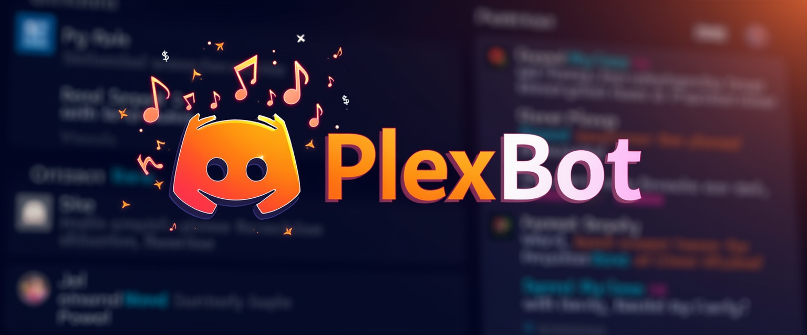

> **Play your Plex music in Discord with style.** <sup><kbd>Alpha 0.5</kbd></sup>

PlexBot streams your Plex music library into Discord voice channels. It has a visual player with album art and labelled
controls, Plex's sonic features (similar tracks, radio, and sonic adventures), and a help menu with screenshots.

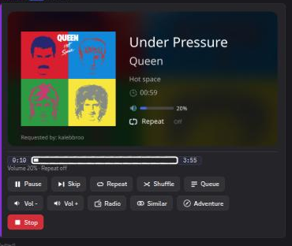

---

## Contents

- [Features](#features)
- [Extensions](#extensions)
- [Your first five minutes](#your-first-five-minutes)
- [The player](#the-player)
- [Static player channel](#static-player-channel)
- [Sonic features](#sonic-features)
- [Commands](#commands)
- [Install](#install)
- [Configuration](#configuration)
- [Custom emoji](#custom-emoji)
- [Remote Lavalink (advanced)](#remote-lavalink-advanced)
- [Performance tuning](#performance-tuning-audio-stuttering)
- [Support](#support)
- [Planned](#planned)
- [License](#license)

---

## Features

- **Plex library playback.** Play a track, a search result, or a whole playlist. Tracks load in the background, so a 90-track playlist starts at once.
- **A player that looks like an app.** Album art, labelled buttons with custom emoji, and volume and repeat shown as text.
- **Sonic features.** Similar tracks (paged, 25 at a time), radio from any track (optionally endless), and sonic adventures between two songs. These use Plex's audio analysis.
- **Search by mood, genre, or radio station**, as well as by name.
- **Queue controls.** Pages of the queue, shuffle, clear, and skip.
- **Static player channel.** Dedicate one channel to a player that is always there.
- **Help inside Discord.** `/help` opens a menu of topics, each with a screenshot.
- **Extensions.** Add sources or commands with the [extensions system](./Docs/Extensions/CreatingExtensions.md).
- **Docker install.** The install script runs PlexBot and Lavalink together.

---

## Extensions

Extensions add music sources and slash commands without changing PlexBot's core. Each one is a folder in `Extensions/` with its own `.csproj`. At startup the bot builds each enabled folder with the .NET SDK (the Docker image includes it), loads it, and registers its commands. To switch one off, rename its folder with a `.disabled` suffix.

**Official extensions**

- **[YouTube Music Provider](https://github.com/kalebbroo/PlexBot-YouTube-MusicProvider)** adds YouTube to `/search` and plays YouTube links through Lavalink's YouTube plugin. It lives in its own repository, so clone it into `Extensions/`. Its optional sign-in (OAuth) is off by default; read [its OAuth notes](https://github.com/kalebbroo/PlexBot-YouTube-MusicProvider#optional-oauth) before you turn it on.

**To install an extension**, clone it into `Extensions/` and rebuild the stack:

```bash
git clone https://github.com/kalebbroo/PlexBot-YouTube-MusicProvider.git Extensions/PlexBot-YouTube-MusicProvider
Install/start.sh --build
```

- **[Build your own extension (tutorial)](./Docs/Extensions/Build-Your-First-Extension.md)** is a step-by-step guide that builds a working `/hello` command from nothing.
- **[Full extension guide](./Docs/Extensions/CreatingExtensions.md)** is the complete reference.

---

## Your first five minutes

**1. Start a track.** Type `/play` and a song name. The bot joins your voice channel and posts the player.

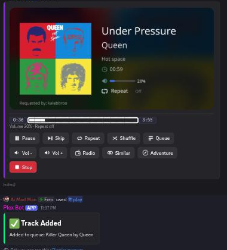

**2. Use the player.** Each button is labelled. Pause, skip, repeat, shuffle and the queue are on the first row.

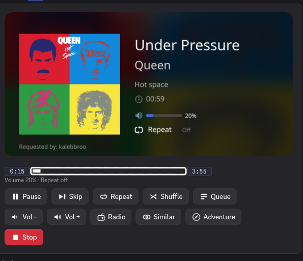

**3. Find music.** `/search` looks by name, mood, genre or radio station. Pick a result from the menu.

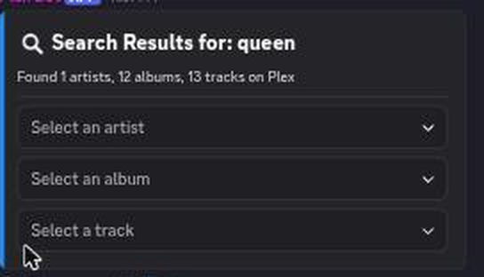

**4. Check the queue.** Press **Queue** on the player. Pages of ten tracks; ⏳ marks a track still loading from Plex.

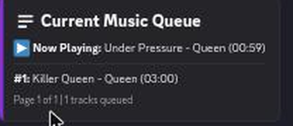

**5. Ask for help.** `/help` opens a menu. Each topic has its own card and screenshot.

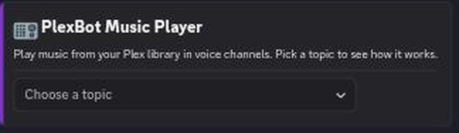

---

## The player

PlexBot has two player styles, set with `visualPlayer.useModernPlayer` in `config.fds`:

| Modern (default) | Classic |
|:-:|:-:|
|  | 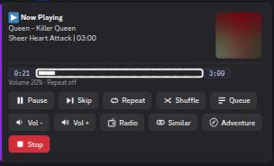 |

Under the progress bar, a status line shows the volume and repeat mode as text, for example `Volume 20% · Repeat off`.

For the full button list and the repeat cycle, see the [Commands guide](./Docs/Guides/Commands.md#player-controls-buttons).
More on the player is in the [Player UI guide](./Docs/Guides/Player-UI-Guide.md).

---

## Static player channel

A static channel keeps one player in one channel. The player is always there, and playback started from any channel
appears in it.

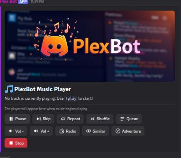

When nothing is playing, the card shows the banner and how to start. After **Stop**, the card returns to this idle state.

**To turn it on:**

1. Create or pick a text channel for the player.
2. Right-click the channel and choose **Copy Channel ID**. You may need Developer Mode in Discord's Advanced settings.
3. In `config.fds`, set:

   ```yaml
   visualPlayer:
     staticChannel:
       enabled: true
       channelId: 1360639203829879097   # your channel's ID
   ```

4. Restart the bot.

> **Heads up:** when the bot starts, it deletes its own old messages in the static channel, then posts the idle card.
> Use a channel for the player only.

---

## Sonic features

These need a Plex track playing and sonic analysis enabled on your Plex server. The buttons are on the second row of the player.

| Button | What it does |
|---|---|
| **Radio** | Replace the queue, add to the queue, or list similar tracks, starting from the current track |
| **Similar** | Show sonically similar tracks. The list pages 25 at a time, with Previous and Next. |
| **Adventure** | Ask where the path should end, then build a path from the current track to that one |

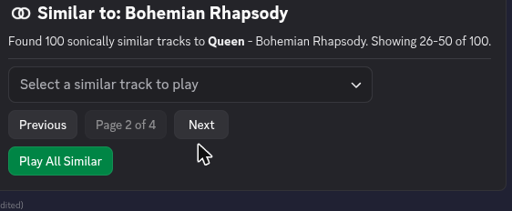

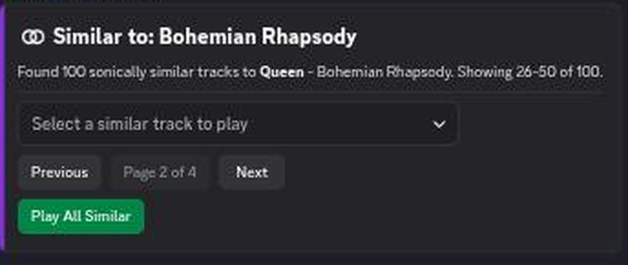

---

## Commands

| Command | What it does |
|---|---|
| `/play [query] [next]` | Play a track by name or link. Queues it, or with `next` plays it after the current track. |
| `/playlist [playlist] [shuffle] [next]` | Queue a Plex playlist, optionally shuffled, or with `next` play it after the current track. |
| `/search [mode] [query]` | Search: **Plex Library**, **Find by Mood**, **Find by Genre**, or **Radio Station**. Extension sources appear here when loaded. |
| `/help` | The help menu. Only you see it. |

**Search examples**

- `/search mode:Plex Library query:"The Beatles"`
- `/search mode:Find by Mood query:Happy`
- `/search mode:Radio Station query:Library Radio`

### Player buttons

| Button | Action |
|---|---|
| Pause / Resume | Toggle playback |
| Back | Go to the track played before this one (the current track is queued to play next) |
| Skip | Next track |
| Repeat | Off → Repeat All → Repeat 1 → Off |
| Shuffle | Shuffle the queue |
| Queue | Show the queue, with shuffle and clear |
| Vol - / Vol + | Change the volume by 10% |
| Radio, Similar, Adventure | Sonic features (above) |
| Stop | Stop, clear the queue, and leave voice |

Buttons have a two-second cooldown, so a repeated click is ignored.

---

## Install

You need:

- Docker and Docker Compose (Docker Desktop is easiest)
- A Discord bot token from the [Developer Portal](https://discord.com/developers/applications)
- Your Plex server URL and token ([how to find your token](https://support.plex.tv/articles/204059436-finding-an-authentication-token-x-plex-token/))

```bash
git clone https://github.com/kalebbroo/PlexBot.git
cd PlexBot
```

1. **Secrets.** Copy `RenameMe.env.txt` to `.env` and fill it in:

   ```env
   DISCORD_TOKEN=your-discord-bot-token
   PLEX_URL=http://your-plex-ip:32400
   PLEX_TOKEN=your-plex-token
   ```

2. **Settings (optional).** `config.fds` is created from `RenameMe.config.fds` if it's missing. Copy the file and edit it to change the player or behaviour.

3. **Run the install script.** `Install/win-install.bat` on Windows, or `Install/linux-install.sh` on Linux. It writes the Lavalink config, builds the Docker images, and starts the bot.

For the full walkthrough see the [Installation guide](./Docs/Setup/Installation.md) and the [Docker guide](./Docs/Setup/Docker-Guide.md).

---

## Configuration

PlexBot reads two files:

| File | Holds | Template |
|---|---|---|
| `.env` | Secrets and infrastructure: tokens, URLs, passwords | `RenameMe.env.txt` (copy it) |
| `config.fds` | Settings: the player, Plex behaviour, logging | `RenameMe.config.fds` (created if missing) |

### `.env`

| Variable | Description | Required |
|---|---|---|
| `DISCORD_TOKEN` | Discord bot token | Yes |
| `PLEX_URL` | Plex server URL with port, e.g. `http://192.168.1.50:32400` | Yes |
| `PLEX_TOKEN` | Plex token | Yes |
| `LAVALINK_HOST` | Lavalink host. `Lavalink` for the Docker install. | No (default `Lavalink`) |
| `LAVALINK_SERVER_PORT` | Lavalink port | No (default `2333`) |
| `LAVALINK_SERVER_PASSWORD` | Lavalink password | No (default `youshallnotpass`) |
| `LAVALINK_SECURE` | `true` for HTTPS/WSS to a remote Lavalink | No (default `false`) |

### `config.fds`

Uses [Frenetic Data Syntax](https://github.com/FreneticLLC/FreneticUtilities), a YAML-like format. You only need to set what you want to change.

**Visual player**

| Key | Default | What it does |
|---|---|---|
| `visualPlayer.useModernPlayer` | `true` | `true` for the album-art player, `false` for the classic embed |
| `visualPlayer.inactivityTimeout` | `2.0` | Minutes of silence before the bot leaves voice |
| `visualPlayer.buttonCooldownSeconds` | `2.0` | Seconds a person must wait between presses of the same button. `0` turns it off. |
| `visualPlayer.staticChannel.enabled` | `false` | Keep the player in one channel (see [Static player channel](#static-player-channel)) |
| `visualPlayer.staticChannel.channelId` | `0` | The channel's ID |
| `visualPlayer.progressBar.enabled` | `true` | Live progress bar. Turn off to make fewer Discord edits. |
| `visualPlayer.progressBar.size` | `medium` | `small`, `medium` or `large` |
| `visualPlayer.progressBar.emoji.*` | _(empty)_ | Optional IDs for the 30-piece smooth progress bar. Empty uses `▓░`. See [Custom emoji](#custom-emoji). |

**Plex**

| Key | Default | What it does |
|---|---|---|
| `plex.stream.maxConcurrentLoads` | `2` | Plex file loads at once. Lower it if tracks fail to load. |
| `plex.stream.retryDelaysSeconds` | `2, 5, 15` | Waits before each retry of a failed load |
| `plex.stream.resolveAhead` | `3` | Queued tracks loaded ahead of the one playing |
| `plex.resolveCacheSize` | `500` | Resolved tracks kept in memory |
| `plex.resolveCacheMinutes` | `60` | How long a resolved track is reused |
| `plex.radio.infinite` | `false` | Keep radio going: when the queue runs low, the bot queues more tracks from the same seed |
| `plex.radio.refillThreshold` | `5` | Refill when fewer than this many tracks are queued |
| `plex.radio.batchSize` | `30` | Tracks fetched per radio request, for the first batch and each refill |

With infinite radio on, a radio session runs until you press **Stop**, press **Kill**, or the bot leaves voice. Tracks
it has already queued are not queued again, and each refill continues from the last track Plex returned.

**Logging and bot**

| Key | Default | What it does |
|---|---|---|
| `logging.level` | `INFO` | Console level: `VERBOSE`, `DEBUG`, `INFO`, `WARN`, `ERROR` |
| `logging.saveToFile` | `true` | Write log files (every level) |
| `logging.path` | `logs/plex-bot-[year]-[month]-[day].log` | Log file path |
| `bot.environment` | _(empty)_ | `Development` registers slash commands per server, which updates faster |

---

## Custom emoji

The player and its panels use 22 emoji. The bot uploads them to its own Discord application on first start, so they
work in every server the bot is in and use no emoji slots.

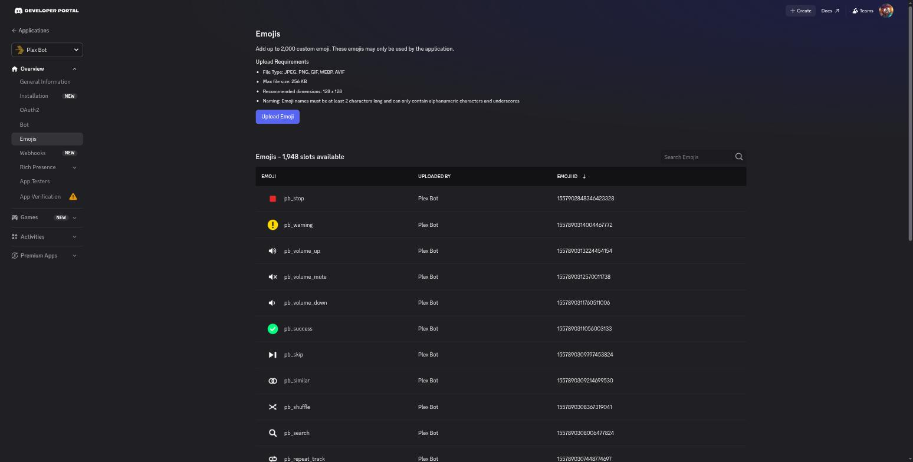

If an emoji can't be used, the bot shows a plain unicode symbol instead, and everything still works. To change the
art, edit the PNG in `Images/Emoji` and restart. See the [Custom Emoji guide](./Docs/Guides/Custom-Emoji.md) for
the full set and how to make your own.

The smooth progress bar uses 30 separate emoji that you set up by hand. See the [Configuration guide](./Docs/Setup/Configuration.md#custom-progress-bar-emoji).

---

## Remote Lavalink (advanced)

By default the install runs Lavalink in Docker next to PlexBot. To use a Lavalink on another machine, change these in `.env`:

```env
LAVALINK_HOST=192.168.1.100          # Lavalink's IP or hostname
LAVALINK_SERVER_PORT=2333            # Must match Lavalink's application.yml
LAVALINK_SERVER_PASSWORD=mypassword  # Must match Lavalink's application.yml
LAVALINK_SECURE=false                # true if it sits behind SSL
```

Then remove the `lavalink` service and its `depends_on` block from `Install/Docker/docker-compose.yml`. You are responsible
for running Lavalink (Java 17 or later, its jar, and its `application.yml`). See the [Lavalink docs](https://lavalink.dev).

---

## Performance tuning (audio stuttering)

If playback stutters, especially when other programs use the same machine, Lavalink's audio thread is being interrupted.
PlexBot doesn't touch the audio stream, so these settings are for Lavalink.

- **Garbage collection.** Set `_JAVA_OPTIONS` in `.env` to use ZGC, which keeps pauses under 1 ms:
  ```env
  _JAVA_OPTIONS=-XX:+UseZGC -XX:+ZGenerational -Xms256m -Xmx512m
  ```
  This uses 10–20% more memory and needs Java 21 or later (the Lavalink 4 image has it).
- **CPU pinning.** Uncomment `cpuset` and `cpu_shares` in [`Install/Docker/docker-compose.yml`](./Install/Docker/docker-compose.yml) to give Lavalink dedicated cores.

Only enable these if you hear stuttering.

---

## Support

- [Troubleshooting](./Docs/Guides/Troubleshooting.md)
- [Player UI guide](./Docs/Guides/Player-UI-Guide.md)
- [Commands guide](./Docs/Guides/Commands.md)
- [Discord dev server](https://discord.com/invite/5m4Wyu52Ek)

---

## Planned

- **More music sources.** Spotify, SoundCloud, and other integrations.
- **User playlists.** Save, manage and share playlists in Discord.
- **More player styles and command panels.**

---

## License

MIT License. See [LICENSE](./LICENSE).

DOWNLOADING OR USING THIS SOFTWARE CONSTITUTES ACCEPTANCE OF THE TERMS AND CONDITIONS OF THE MIT LICENSE. THIS SOFTWARE IS PROVIDED "AS IS" AND WITHOUT WARRANTIES OF ANY KIND, EITHER EXPRESSED OR IMPLIED.

---

> PlexBot is not affiliated with Plex, YouTube, or Discord.
> PlexBot and Kaalebbroo.Dev are affiliated with Hartsy.AI (Allowing artists to control how their work is used)
